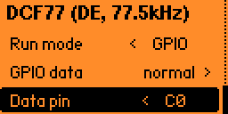
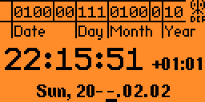
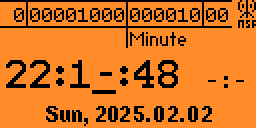
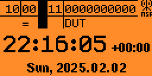

# Longwave Clock

This is a Flipper Zero app to receive and decode, or simulate, multiple time signal broadcasts with different protocols and time formats. For receiving via GPIO, an inexpensive receiver connected to a receiving pin is required.

## Protocol support

### DCF77 (DE, 77.5 kHz)

  

[DCF77](https://en.wikipedia.org/wiki/DCF77) is broadcasted from Frankfurt am Main in Germany ([50.0155,9.0108](https://www.openstreetmap.org/?mlat=50.0155&mlon=9.0108#map=4/50.01/9.01)) and requires an antenna tuned to 77.5 kHz.

- The radio transmission can be received all over Europe (~2000 km from the sender).
- 1 bit per second is transmitted by reducing carrier power at the beginning of every second.
- The transmission encodes time, date as well as catastrophe and weather information (encrypted, not decoded).

### MSF (UK, 60 kHz)

  

[MSF (Time from NPL/Rugby clock)](https://en.wikipedia.org/wiki/Time_from_NPL_(MSF)) is broadcasted from Anthorn in the UK ([54.9116,-3.2785](https://www.openstreetmap.org/?mlat=54.9116&mlon=-3.2785#map=5/54.91/-3.27)) and requires an antenna tuned to 60 kHz (as does [WWVB](#WWVB)).

- The radio transmission can be received over most of western and northern Europe.
- The transmission encodes time, date as well as DUT1 bits (difference between atomic and astronomical time).
- The app only supports the slow code at 120 bits per minute, of which only 60bits  are encoded.

### WWVB (US, 60 kHz)

[WWVB](https://en.wikipedia.org/wiki/WWVB) is on the backlog for the Longwave app.

If you're based in the US and would like to help: PRs are welcome!