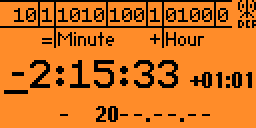
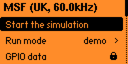
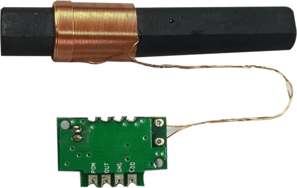
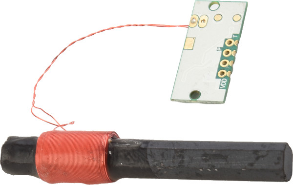

# Longwave Clock

This is a Flipper Zero app to receive and decode, or simulate, multiple time signal broadcasts with different protocols and time formats. For receiving via GPIO, an inexpensive receiver connected to a receiving pin is required.

## Protocol support

### DCF77 (Europe, Germany)

  

[DCF77](https://en.wikipedia.org/wiki/DCF77) is broadcasted from Frankfurt am Main in Germany ([50.0155,9.0108](https://www.openstreetmap.org/?mlat=50.0155&mlon=9.0108#map=4/50.01/9.01)) and requires an antenna tuned to 77.5 kHz.

- The radio transmission can be received all over Europe (~2000 km from the sender).
- 1 bit per second is transmitted by reducing carrier power at the beginning of every second.
- The transmission encodes time, date as well as catastrophe and weather information (encrypted, not decoded).

### MSF (Europe, United Kingdom)

  

[MSF (Time from NPL/Rugby clock)](https://en.wikipedia.org/wiki/Time_from_NPL_(MSF)) is broadcasted from Anthorn in the UK ([54.9116,-3.2785](https://www.openstreetmap.org/?mlat=54.9116&mlon=-3.2785#map=5/54.91/-3.27)) and requires an antenna tuned to 60 kHz (as does [WWVB](#wwvb-north-america-us)).

- The radio transmission can be received over most of western and northern Europe.
- The transmission encodes time, date as well as DUT1 bits (difference between atomic and astronomical time).
- The app only supports the slow code at 120 bits per minute, of which only 60bits  are encoded.
- Same frequency as WWVB - in Europe you will receive this signal through a WWVB receiver.

### WWVB (North America, US)

[WWVB](https://en.wikipedia.org/wiki/WWVB) transmits on 60 kHz and is on the backlog for the Longwave app.

If you're based in the US and would like to help: PRs are welcome!

## GPIO modules

The app supports a demonstration mode as well as GPIO mode. For GPIO mode, external modules are required.

In GPIO mode the following configuration is available (per protocol):
- GPIO data: use "inverted" if the module outputs logic high to the data pin when the sender signal is low (hopefully rare).
- Data pin: this configures the receiving pin on the flipper, C0 is the default and recommended pin.

### Supported modules

The following shows modules that I own and have been successfully tested for reception.

#### 77.5 kHz module (DCF77)

 

You can find this type of module by searching for "DCF77 module" in any electronics online shop.

#### 60.0 kHz module (MSF, WWVB)

 

Search for "WWVB module" in any electronics online shop. 
This applies even if you want to receive MSF instead: they use the same frequency.

### Pinout

The modules I checked are pretty much the same, here is the common pinout configuration I found and tested.
Please check with the manufacturer, as yours might be different and you may cause damage by wiring the module incorrectly. 

- **VDD**: flipper pin 9 (3V3)
- **GND** / unlabeled: flipper pin 11 (GND)
- **PON** / **P**: power on, asks for "logic low", using flipper pin 11 (GND)
- **OUT** / **T**: the data signal, using flipper pin 16 (C0)
